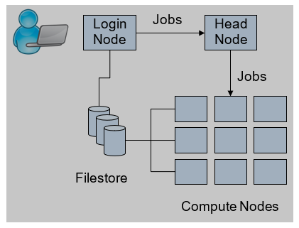

How the HEC Works
=================

The HEC has three basic components:

* a login node, where users access the HEC to submit jobs;

* the compute nodes, which run those jobs; 

* dedicated file systems, which share users' files and 
  applications across the cluster.

From the login node, users create a batch job script which 
describes the tasks their job(s) are to perform in a format 
similar to a unix shell script. The batch job is then 
submitted to the SLURM job scheduler which will portion out 
user jobs to free compute nodes. Batch job scripts can 
also contain additional information such as requests 
for specific amounts of memory (for large memory jobs), or 
multiple nodes (in the case of parallel jobs).

Hardware
--------

**Login node**: The login node is a 6-core virtual machine 
emulating Haswell architecture, with 48GB of memory.

**Compute nodes**: The compute nodes consist of around 400 
servers covering a variety of generations of Intel processor, 
offering a mixture of 16 cores (Ivy Bridge through to 
Broadwell architecture), 40 cores (for Skylake) and 64 cores 
(Cascade Lake and Ice Lake). The memory size for a standard 
compute node is 4G per core. Compute node network interconnects are 
10 or 25 Gbit/s low latency Ethernet.

**File store**: The primary file storage system is a 230TB 
PixStor GPFS Storage Cluster. A series of storage nodes 
act as secondary file system providing 10PB of CEPH-based 
filestore for the local GridPP initiative.

Software
--------

A number of popular research applications, statistical and numerical packages
and libraries are installed in addition to Fortran, C and C++ compilers. 
Most software is accessed via :doc:`environment modules</envmods>`.
